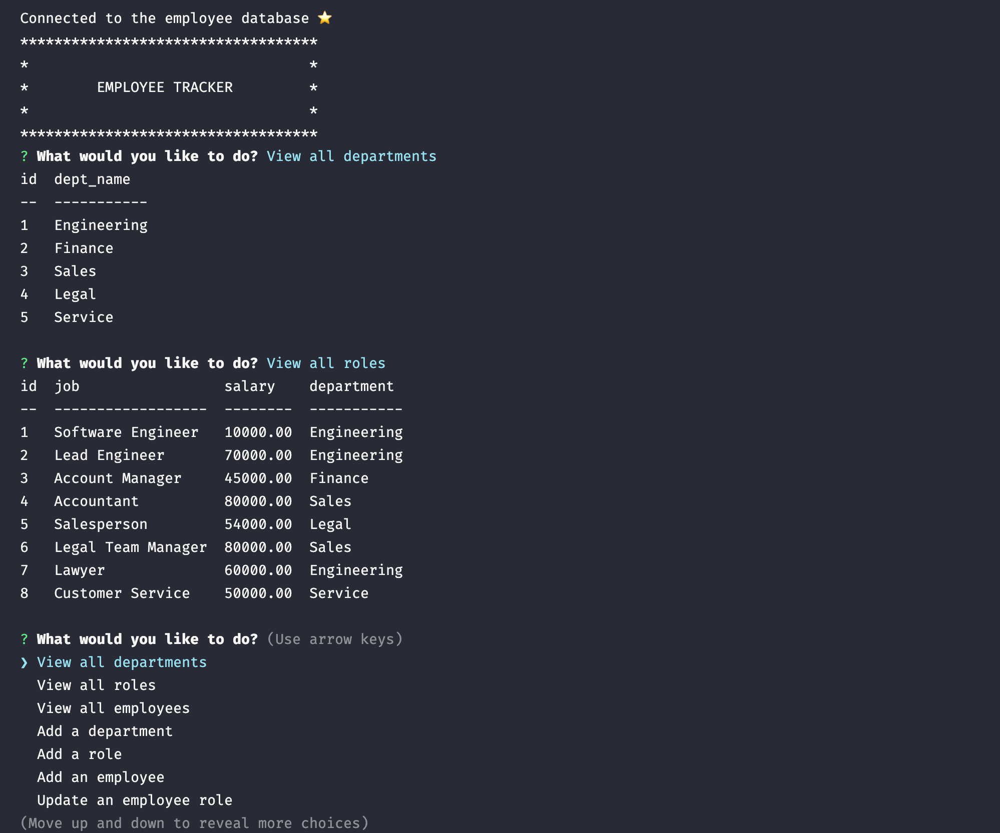

# SQL : Employee Tracker


## Description
A command line application that manages a company's employee database using Node.js, Inquirer, and MySQL. The user can view, update, and add information about their business through the command line application.

## Table of Contents
- [User Story](#user-story)
- [Installation](#installation)
- [Usage](#usage)
- [Media](#media)
- [License](#license)
- [Contributing](#contributing)
- [Questions](#questions)

## User Story

```
AS A business owner
I WANT to be able to view and manage the departments, roles, and employees in my company
SO THAT I can organize and plan my business
```

## Installation

Please fork this repository over to your local system.

Once you have forked this repository, please initialize the npm modules into the repository through the command `npm install`. The package.json file holds the necessary dependencies for Node.js, Inquirer, and MySQL.

The `server.js` file contains the code to initialize the application. The `lib` folder contains the javascript functionality required to run the database queries. The `db` folder contains the database, the table constructor, and the seeds to populate the tables in MySQL for testing the application.

Once you have cloned the repository to your local system and initialized the npm modules, please run your MySQL server to set up the database. Type in the following commands into your MySQL server to set up the database.

- `use employee_db`
- `source db/db.sql`
- `source db/schema.sql`
- `source db/seeds.sql`

## Usage

- Complete the installation steps outlined above
- The server.js file contains the methods to initialize database
- Initialize your command-line within the root directory of this repository
- Initialize Node.js by entering `npm start` into your command-line
- Answer the following command-line prompts for your specified tasks!

### Media

[Walthrough Video](https://drive.google.com/file/d/1Hgd13TaKXh2BWk7x4XDrlITAYyLCW0KE/view)



## License
This application is licensed under the MIT license. Please click on the link below to learn more.

https://opensource.org/licenses/MIT

## Contributing

Pull requests are welcome. For major changes, please open an issue first to discuss what you would like to change.

## Questions

Please direct any questions about this project to olivelliott48@gmail.com. If you would like to see more projects, visit the GitHub link below.

https://www.github.com/olivelliott
